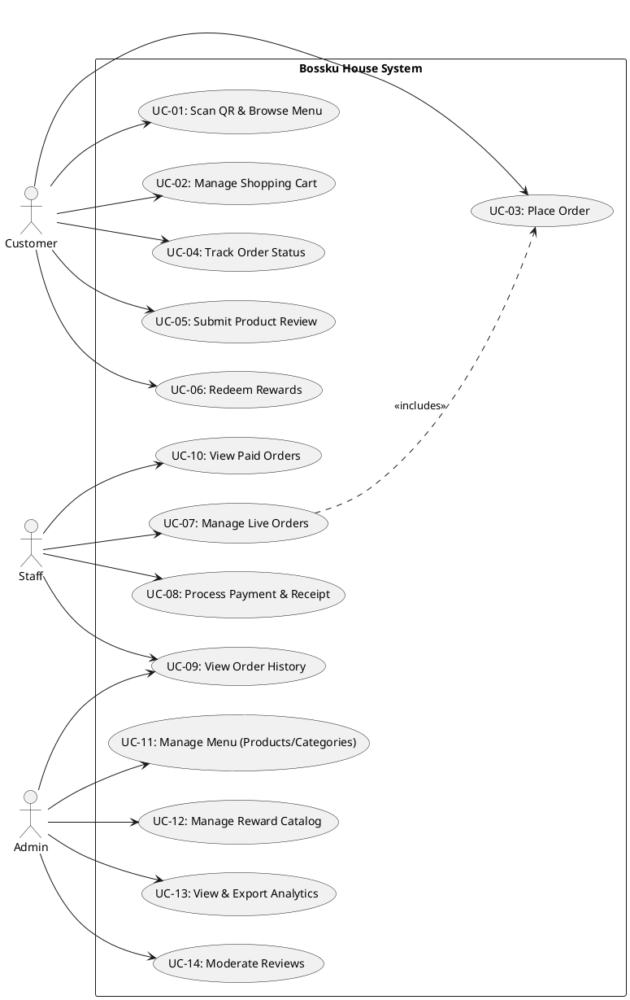

# Use Case Specification: Bossku House

## 1. Use Case Diagram

---

## 2. Use Case Summary Table

| ID | Use Case Name | Actor | Description |
| :--- | :--- | :--- | :--- |
| **UC-01** | Scan QR & Browse Menu | Customer | Customer scans table QR to view the digital menu with bound table ID. |
| **UC-02** | Manage Shopping Cart | Customer | Customer adds/removes items and adjusts quantities. |
| **UC-03** | Place Order | Customer | Customer submits the cart to create a new order. |
| **UC-04** | Track Order Status | Customer | Customer monitors real-time preparation status via reference ID. |
| **UC-05** | Submit Product Review | Customer | Customer provides feedback and ratings for specific items. |
| **UC-06** | Redeem Rewards | Customer | Authenticated customer exchanges points for rewards. |
| **UC-07** | Manage Live Orders | Staff | Staff views and updates status of incoming orders (Preparing/Served). |
| **UC-08** | Process Payment & Receipt | Staff | Staff marks order as paid and generates a digital receipt. |
| **UC-09** | View Order History | Staff, Admin | Staff/Admin views the historical log of all previous orders. |
| **UC-10** | View Paid Orders | Staff | Staff monitors a filtered list of orders that have completed payment. |
| **UC-11** | Manage Menu | Admin | Admin performs CRUD on categories and products. |
| **UC-12** | Manage Reward Catalog | Admin | Admin sets up rewards and point requirements. |
| **UC-13** | View & Export Analytics | Admin | Admin monitors business performance and downloads reports. |
| **UC-14** | Moderate Reviews | Admin | Admin deletes or manages customer feedback. |

---

## 3. Detailed Use Case Specifications

### **UC-02: Manage Shopping Cart**
| | | |
| :--- | :--- | :--- |
| **Use Case ID** | UC-02 | |
| **Use Case Name** | Manage Shopping Cart | |
| **Description** | Updates the user's shopping cart by adding, modifying, or removing items, and ensures the cart reflects the correct total. | |
| **Primary Actor** | Customer | |
| **Include use cases** | None | |
| **Scenario** | **Step** | **Action** |
| **Main Flow** | Pre-Condition | 1. The user must have scanned a QR code or accessed the menu.   2. Products must be available in the menu. |
| | 1.1 | The system receives an action from the user (e.g., clicking "Add to Cart"). |
| | 1.2 | The system validates the item availability and current price. |
| | 1.3 | The system updates the cart data (add item). |
| | 1.4 | The updated cart summary and total price are displayed to the user. |
| | Post-Condition | 1. The cart is updated with the selected changes.   2. The updated totals are visible in the cart modal. |
| **Alternate Flow** | 1.1a | **Clear Cart**: User clicks the "Clear Cart" button instead of removing one by one. |
| | 1.2a | The system removes all items from the session immediately. |
| | 1.3a | The system displays an empty cart state to the user. |
| **Robust Flow** | Pre-Condition | The user has added at least one item to the cart. |
| | 2.1 | User attempts to set quantity to zero. |
| | 2.2 | The system automatically removes the item from the cart. |
| | Post-Condition | The item is removed and total is recalculated. |

---

### **UC-03: Place Order**
| | | |
| :--- | :--- | :--- |
| **Use Case ID** | UC-03 | |
| **Use Case Name** | Place Order | |
| **Description** | Processes the submission of the shopping cart into a live order tied to a specific table. | |
| **Primary Actor** | Customer | |
| **Include use cases** | UC-02 | |
| **Scenario** | **Step** | **Action** |
| **Main Flow** | Pre-Condition | 1. The cart must contain at least one item.   2. A table ID must be present in the session. |
| | 1.1 | The customer clicks the "Place Order" button in the cart modal. |
| | 1.2 | The system validates the cart content against current menu availability. |
| | 1.3 | The system generates a unique Reference Number (e.g., BK-1234). |
| | 1.4 | The system saves the order to MySQL and pushes a real-time notification to Firebase. |
| | 1.5 | The system redirects the user to the Tracking Page. |
| | Post-Condition | 1. A new order record is created.   2. Staff is notified via the real-time dashboard. |
| **Alternate Flow** | 1.1b | **Order Notes**: User adds specific cooking instructions in the "Notes" field before placing the order. |
| | 1.2b | The system saves the notes alongside the order items for staff viewing. |
| **Robust Flow** | Pre-Condition | User attempts to place an order with an empty cart. |
| | 2.1 | User clicks "Place Order" while cart is empty. |
| | 2.2 | The system displays an error: "Your cart is empty." |
| | Post-Condition | No order is created. |

---

### **UC-08: Process Payment & Receipt**
| | | |
| :--- | :--- | :--- |
| **Use Case ID** | UC-08 | |
| **Use Case Name** | Process Payment & Receipt | |
| **Description** | Handles the finalization of an order by marking it as paid and generating a customer receipt. | |
| **Primary Actor** | Staff | |
| **Include use cases** | None | |
| **Scenario** | **Step** | **Action** |
| **Main Flow** | Pre-Condition | 1. The order status must be "Served".   2. Staff must be logged in. |
| | 1.1 | Staff selects the order in the Cashier dashboard. |
| | 1.2 | Staff clicks "Mark as Paid" upon receiving payment. |
| | 1.3 | The system updates the order status to "Paid" and records the timestamp. |
| | 1.4 | The system enables the "View Receipt" button. |
| | 1.5 | Staff clicks "View Receipt" to display/print the transaction summary. |
| | Post-Condition | 1. Order status is finalized.   2. Transaction is logged for analytics. |
| **Alternate Flow** | 1.2c | **Direct Receipt View**: Staff views the receipt for an order that was already marked as paid from the "Paid Orders" history. |
| | 1.3c | The system skips the payment update and directly renders the receipt view. |
| **Robust Flow** | Pre-Condition | Staff attempts to mark an already paid order as paid. |
| | 2.1 | User clicks "Mark as Paid" on a completed order. |
| | 2.2 | The system hides the button or displays a "Paid" badge. |
| | Post-Condition | No duplicate payment record is created. |

---

### **UC-11: Manage Menu (Admin)**
| | | |
| :--- | :--- | :--- |
| **Use Case ID** | UC-11 | |
| **Use Case Name** | Manage Menu | |
| **Description** | Allows the administrator to maintain the digital menu by managing products and categories. | |
| **Primary Actor** | Admin | |
| **Include use cases** | None | |
| **Scenario** | **Step** | **Action** |
| **Main Flow** | Pre-Condition | Admin is authenticated with administrative privileges. |
| | 1.1 | Admin navigates to the Products or Categories management page. |
| | 1.2 | Admin submits a form for a new item (Name, Price, Image). |
| | 1.3 | The system validates the input and uploads any new image to Firebase. |
| | 1.4 | The system updates the database and refreshes the cache for the customer menu. |
| | Post-Condition | The digital menu reflects the changes immediately. |
| **Alternate Flow** | 1.1d | **Edit Existing Product**: Admin clicks "Edit" instead of "Add New". |
| | 1.2d | The system populates the form with existing data for modification. |
| | 1.3d | Admin updates specific fields and clicks "Update". |
| **Robust Flow** | Pre-Condition | Admin attempts to save a product without a required field. |
| | 2.1 | User leaves the "Price" field empty. |
| | 2.2 | The system displays a validation error: "The price field is required." |
| | Post-Condition | Database is not updated with invalid data. |
